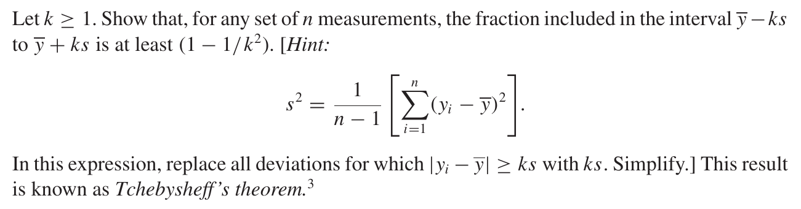
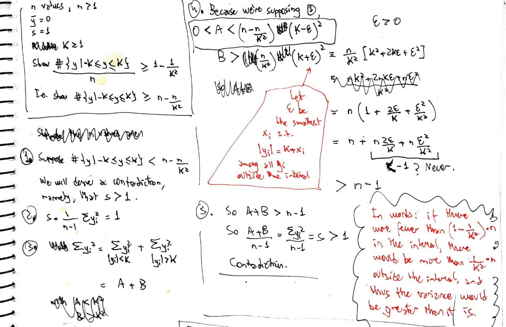

# Chapter 1: What is statistics? {-}

## 1.2 Graphical methods {-}

### 1.8 {-}

::: {.rmdbox}

An article in *Archaeometry* presented an analysis of $26$ samples of Romano–British pottery, found at four different kiln sites in the United Kingdom. The percentage of aluminum oxide in each of the $26$ samples is given below:

```{r}
df1 <- tibble(
  location = 'Llanederyn',
  value = c(
    14.4, 11.6, 13.8, 11.1, 14.6, 13.4, 11.5, 12.4, 13.8, 13.1, 10.9, 12.7, 
    10.1, 12.5
  )
)

df2 <- tibble(
  location = 'Caldicot',
  value = c(11.8, 11.6)
)

df3 <- tibble(
  location = 'Island Thorns',
  value = c(18.3, 15.8, 18.0, 18.0, 20.8)
)

df4 <- tibble(
  location = 'Ashley Rails',
  value = c(17.7, 18.3, 16.7, 14.8, 19.1)
)

df <- bind_rows(df1, df2, df3, df4)
df
```

:::

a. Construct a relative frequency histogram:

    ```{r}
    brks <- 10:21
    
    df %>% 
      ggplot(aes(value)) +
        geom_histogram(
          breaks = brks,
          boundary = brks[1]
        ) +
        scale_x_continuous(
          breaks = brks
        ) +
        labs(
          x = NULL,
          y = NULL
        )
    ```

b. What unusual feature do you see in this histogram? Looking at the data, can you think of an explanation for this unusual feature?

   What unusual feature? Bimodality. Trimodality, rather.
   
   Let's check by location. A histogram with different fill colors!
   
    ```{r}
    df %>% 
      ggplot(aes(value, fill = location)) +
        geom_histogram(
          breaks = brks,
          boundary = brks[1]
        ) +
        scale_x_continuous(
          breaks = brks
        ) +
        theme(legend.position = "bottom") +
        labs(
          x = NULL,
          y = NULL,
          fill = NULL
        )
    ```
   
   Or boxplots:
   
    ```{r}
    df %>% 
      ggplot() +
        geom_boxplot(
          aes(x = location, y = value, fill = location)
        ) +
        guides(fill = 'none') +
        labs(
          x = NULL,
          y = NULL
        )
    ```
   
## 1.3 Numerical methods {-}

### 1.11 {-}

$$
\begin{align*}
s^2 
&= \frac{1}{n-1} \sum(y_i - \bar y)^2 \\
&= \frac{1}{n-1} \left[ \sum y_i^2 - 2\bar y \sum y_i + n \bar y^2\right] \\
&= \frac{1}{n-1} \left[ \sum y_i^2 - 2n\bar y \frac{\sum y_i}{n} + n \bar y^2\right] \\
&= \frac{1}{n-1} \left[ \sum y_i^2 - 2n\bar y \bar y + n \bar y^2\right] \\
&= \frac{1}{n-1} \left[ \sum y_i^2 - 2n\bar y^2 + n \bar y^2\right] \\
&= \frac{1}{n-1} \left[ \sum y_i^2 -  n \bar y^2\right] \\
&= \frac{1}{n-1} \left[ \sum y_i^2 -  n \left(\frac{\sum y_i}{n}\right)^2 \right] \\
&= \frac{1}{n-1} \left[ \sum y_i^2 -  \frac1n \left(\sum y_i\right)^2 \right]
\end{align*}
$$

### 1.17 {-}

::: {.rmdbox}

The *range* of a set of measurements is the difference between the largest and the smallest values. The empirical rule suggests that the standard deviation of a set of measurements may be roughly approximated by one-fourth of the range (that is, range/$4$). Calculate this approximation to s for the data sets in Exercises 1.2, 1.3, and 1.4. Compare the result in each case to the actual, calculated value of $s$.

:::

```{r}
f <- function(x) {
  
  n <- length(x)
  r4 <- range(x) %>% reduce(`-`) * -1/4
  r6 <- range(x) %>% reduce(`-`) * -1/6
  std <- sd(x) * (n - 1) / n
  
  cat('\nRange / 4: ', r4)
  cat('\nRange / 6: ', r6)
  cat('\nStd. dev.: ', std)
  
}
```


#### 1.2 {-}

```{r}
dados <- c(
  8.9, 12.4, 8.6, 11.3, 9.2, 8.8, 35.1, 6.2, 7.0, 7.1, 11.8, 10.7, 7.6, 9.1, 
  9.2, 8.2, 9.0, 8.7, 9.1, 10.9, 10.3, 9.6, 7.8, 11.5, 9.3, 7.9, 8.8, 8.8, 12.7,
  8.4, 7.8, 5.7, 10.5, 10.5, 9.6, 8.9, 10.2, 10.3, 7.7, 10.6, 8.3, 8.8, 9.5, 
  8.8, 9.4
)

f(dados)
```

#### 1.3 {-}

```{r}
dados <- c(
  .74, 6.47, 1.90, 2.69, .75, .32, 9.99, 1.77, 2.41, 1.96, 1.66, .70, 2.42, .54,
  3.36, 3.59, .37, 1.09, 8.32, 4.06, 4.55, .76, 2.03, 5.70, 12.48
)

f(dados)
```


#### 1.4 {-}

```{r}
dados <- c(
  11.88, 6.27, 5.49, 4.81, 4.40, 3.78, 3.44, 3.11, 2.88, 2.68, 7.99, 6.07, 5.26,
  4.79, 4.05, 3.69, 3.36, 3.03, 2.74, 2.63, 7.15, 5.98, 5.07, 4.55, 3.94, 3.62,
  3.26, 2.99, 2.74, 2.62, 7.13, 5.91, 4.94, 4.43, 3.93, 3.48, 3.20, 2.89, 2.69,
  2.61
)

f(dados)
```

### 1.19 {-}

::: {.rmdbox}

According to the Environmental Protection Agency, chloroform, which in its gaseous form is suspected to be a cancer-causing agent, is present in small quantities in all the country's $240.000$ public water sources. If the mean and standard deviation of the amounts of chloroform present in water sources are $34$ and $53$ micrograms per liter (μg/L), respectively, explain why chloroform amounts do not have a normal distribution.

:::

```{r}
ggplot() +
  stat_function(
    fun = dnorm,
    args = c(34, 53),
    xlim = c(-200, 200)
  ) +
  stat_function(
    fun = dnorm,
    args = c(34, 53),
    xlim = c(-200, 0),
    fill = 'red',
    geom = 'area',
    alpha = .5
  ) +
  labs(
    x = NULL,
    y = NULL
  ) +
  geom_text_repel(
    aes(
      label = pnorm(0, 34, 53) %>% round(2),
      x = -50,
      y = .001,
    ),
    nudge_x = -100,
    nudge_y = .0008
  )
```

If the distribution were normal, about $25\%$ of the amounts would have to be negative.


### 1.25 {-}

::: {.rmdbox}

The following data give the lengths of time to failure for $n = 88$ radio transmitter-receivers:

```{r}
dados <- c(
  16, 224, 16, 80, 96, 536, 400, 80, 392, 576, 128, 56, 656, 224, 40, 32, 358,
  384, 256, 246, 328, 464, 448, 716, 304, 16, 72, 8, 80, 72, 56, 608, 108, 194,
  136, 224, 80, 16, 424, 264, 156, 216, 168, 184, 552, 72, 184, 240, 438, 120,
  308, 32, 272, 152, 328, 480, 60, 208, 340, 104, 72, 168, 40, 152, 360, 232, 40,
  112, 112, 288, 168, 352, 56, 72, 64, 40, 184, 264, 96, 224, 168, 168, 114, 280,
  152, 208, 160, 176
)
```

:::

a. Use the range to approximate s for the n = 88 lengths of time to failure.

    ```{r}
    f(dados)
    ```

b. Construct a frequency histogram for the data.

    ```{r}
    dados %>% 
      as_tibble() %>% 
      ggplot() +
        geom_histogram(
          aes(value),
          breaks = seq(0, max(dados) + 99, 100)
        ) +
        scale_x_continuous(
          breaks = seq(0, max(dados) + 99, 100)
        ) +
        labs(
          x = NULL,
          y = NULL
        )
    ```

c. Calculate $\bar y$ and $s$.

    ```{r}
    mean(dados)
    sd(dados)
    ```

d. Calculate the intervals $\bar y \pm ks$, $k = 1, 2$, and $3$, and count the number of measurements falling in each interval. Compare your results with the empirical rule results. Note that the empirical rule provides a rather good description of these data, even though the distribution is highly skewed.

    ```{r}
    brks <- -3:3 * sd(dados) + mean(dados)
    brks <- brks[-4]
    mean(dados > brks[3] & dados < brks[4])
    mean(dados > brks[2] & dados < brks[5])
    mean(dados > brks[1] & dados < brks[6])
    ```


### 1.26 {-}

::: {.rmdbox}

Compare the ratio of the range to $s$ for the three sample sizes ($n = 6, 20$, and $88$) for Exercises 1.12, 1.24, and 1.25. Note that the ratio tends to increase as the amount of data increases. The greater the amount of data, the greater will be their tendency to contain a few extreme values that will inflate the range and have relatively little effect on $s$. We ignored this phenomenon and suggested that you use $4$ as the ratio for finding a guessed value of $s$ in checking calculations.

:::

I could try to do more.

* Suppose the population is normally distributed.

* Examine all samples. See how the ratio $\frac{\text{range}}{s}$ varies as $n$ varies.

Well, seems like I am interested in the random variable
$$
X = \frac{\text{range}}{s} = \frac{\max - \min}{s}
$$

What is the distribution of $X$? Where does $n$ come in?

Must consider population range too?

Maybe some day.


### 1.32 (Tschebysheff) {-}

{ style="width: 90%" .center}

{ style="width: 90%" .center}


