# Chapter 2: Probability {-}

## 2.6 Tools for counting sample points {-}

### 2.70 {-}

::: {.rmdbox}

Consider the situation where $n$ items are to be partitioned into $k < n$ distinct subsets. The multinomial coefficients 

$$
n \choose n_1\; n_2\; \cdots\; n_k
$$

provide the number of distinct partitions where $n_1$ items are in group $1$, $n_2$ are in group $2$, $\dots$, $n_k$ are in group $k$. 

Prove that the total number of distinct partitions equals $k^n$.

:::

Took me a long time to understand what is being asked (and I had to consult [Wikipedia](https://en.wikipedia.org/wiki/Multinomial_theorem#Sum_of_all_multinomial_coefficients)). I must show that

$$
\sum_{n_1 + n_2 + \cdots + n_k = n} {n \choose n_1\; n_2\; \cdots\; n_k} = k^n
$$

The multinomial theorem states that

$$
(x_{1}+x_{2}+\cdots +x_{m})^{n} =
\sum _{k_{1}+k_{2}+\cdots +k_{m}=n}{n \choose k_{1}\,k_{2}\,\ldots \,k_{m}}\prod _{t=1}^{m}x_{t}^{k_{t}}
$$

If I make all $x_i = 1$, then I have the equality that was asked for.

This is just a generalization of the binomial theorem:

$$
(x+y)^{n}=\sum _{k=0}^{n}{n \choose k}x^{k}y^{n-k}
$$


I will use this opportunity to review [Bell numbers](https://en.wikipedia.org/wiki/Bell_number) and [Stirling numbers](https://en.wikipedia.org/wiki/Stirling_number), which are related.


### Bell numbers {-}

::: {.rmdimportant}

$B_n$ is the number of partitions of an $n$-element set.

These numbers can be computed by the recurrence

$$
\begin{cases}
\begin{align*}
B_0 &= 1\\
B_{n+1} &= \sum_{k = 0}^{n} {n \choose k} B_k 
\end{align*}
\end{cases}
$$

:::

The idea is: if I already know the numbers of partitions of $k$-element sets, $0 \leq k \leq n$, and now I have an $(n+1)$th element, I need to

* Choose $n - k$ elements to be in the same block as the new element. This can be done in ${n - k \choose k} = {n \choose k}$ ways.

* Partition the remaining $k$ elements. This can be done in $B_k$ ways.

I can also define $B_n$ with another recurrence:

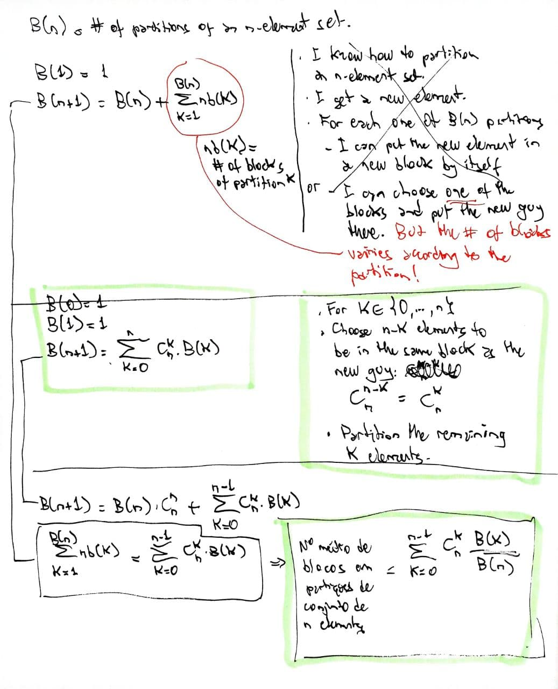{ style="width: 90%" .center}

But then I have to know the number of blocks in each partition, and I have to prove that both recurrences coincide. Maybe some day.

The package `numbers` has a function to compute $B_n$:

```{r}
library(numbers)
map_dbl(1:10, bell)
```

The documentation says $n$ must be $22$ or smaller, but

```{r}
bell(25)
```

### Stirling numbers (of the second kind) {-}

::: {.rmdimportant}

$S(n, k)$ is the number of partitions (into $k$ blocks) of an $n$-element set.

These numbers can be given by the recurrence

$$
\begin{cases}
S(n, k) = 1 & \text{if } n = k \text{ or } k = 1 \\
S(n, k) = 0 & \text{if } n < k \\
S(n+1, k+1) = S(n, k) + (k+1)S(n, k + 1) & \text{if } n > k \\
\end{cases}
$$

:::

The idea is, if I receive an $(n+1)$th element and I want $k+1$ blocks, I can

* Partition the original $n$ elements into $k$ blocks and put the new element in a new block by itself, OR

* Partition the original $n$ elements into $k + 1$ blocks and put the new element in one of those blocks.

Another recurrence is

$$
\begin{cases}
S(n, k) = 1 & \text{if } n = k \text{ or } k = 1 \\
S(n, k) = 0 & \text{if } n < k \\
S(n+1, k+1) = S(n, k) + \sum_{i=k}^{n-1} {n\choose i} S(i, k) & \text{if } n > k \\
\end{cases}
$$

The idea now is that, if I receive an $(n+1)$th element and I want $k+1$ blocks, I can

* Partition the original $n$ elements into $k$ blocks and put the new element in a new block by itself, OR

* Like in the recurrence for Bell numbers, choose $n - i$ of the $n$ original elements to be the companions of the new element ($i \in \{k, \ldots, n-1\}$) and partition the remaining $i$ elements in $k$ blocks. 

And I have to prove this is equivalent to the previous recurrence for $S(n,k)$. Maybe some day.

In R:

```{r}
library(gmp)
map(3:5, ~Stirling2(.x, 2))
```


```{r}
ms <- function(n, k) {
  
  if (n < k) return(0)
  if (n == k || k == 1) return(1)

  n <- n - 1
  k <- k - 1
    
  s <- ms(n, k) 
  for (i in k:(n-1)) {
    s <- s + choose(n, i) * ms(i, k)
  }
  
  s
  
}

msa <- function(n) {
  
  map(1:n, ~ms(n, .x))
  
}
```


```{r}
resultados_gmp <- map(3:10, Stirling2.all)
resultados_mine <- map(3:10, msa)
squashed_mine <- resultados_mine %>% map(rlang::squash_dbl)
squashed_gmp <- resultados_gmp %>% map(as.numeric) %>% rlang::squash()
identical(squashed_gmp, squashed_mine)
```

### Link between Bell and Stirling {-}

$$
B_n = \sum_{k = 1}^n S(n, k)
$$

### Multinomial coefficients a bit more in depth {-}

At first, I was confused by the fact that

$$
{4 \choose 2\;1\;1} = 12
$$

because I could only find myself the following $6$ "partitions" of $A = \{a, b, c, d\}$ with $3$ blocks sized $2, 1$, and $1$, respectively:

$$
\begin{array}{l|l|l|l}
\hline
1 & ab & c & d \\
2 & ac & b & d \\
3 & ad & b & c \\
4 & bc & a & d \\
5 & bd & a & c \\
6 & cd & a & b \\
\hline
\end{array}
$$

I need a more formal definition of when partitions are different.

Then I found [this pdf](http://math.arizona.edu/~faris/combinatoricsweb/multinomial.pdf) by [William Faris](https://www.math.arizona.edu/~faris/) in an internet search. There, partitions are defined as multisets, and everything makes sense.

My notes are below. 

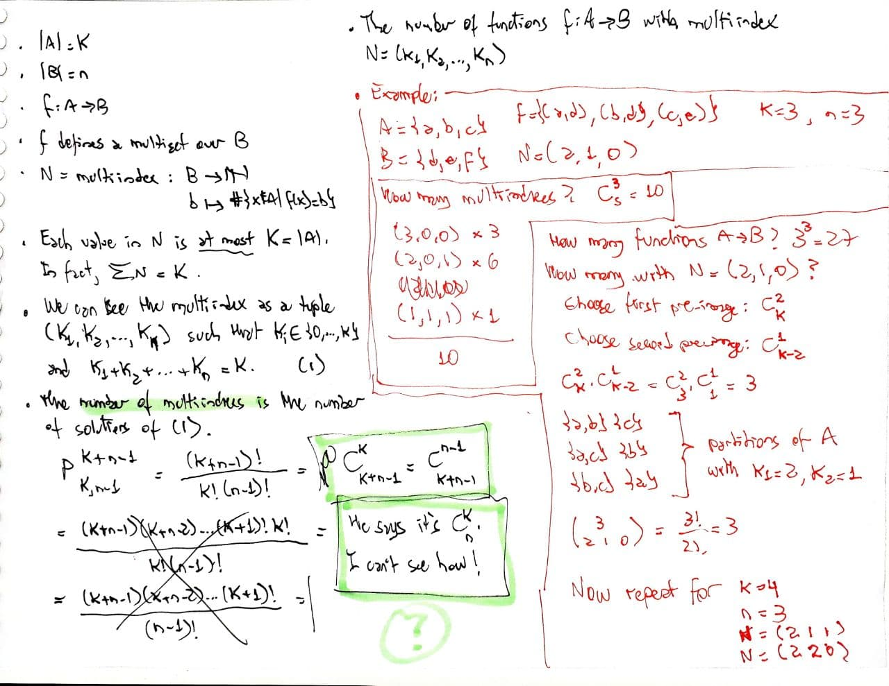{ style="width: 90%" .center}

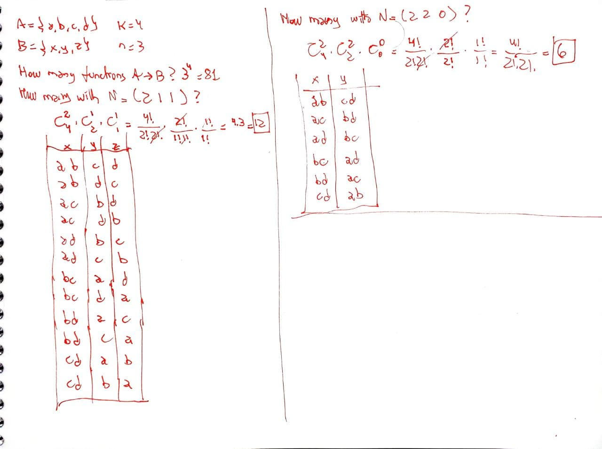{ style="width: 90%" .center}

### Stirling and multinomial numbers don't agree! {-}

Note that [Stirling numbers always consider the blocks to be indistinguishable, even if they have different sizes.]{.hl} 

In general, [multinomial numbers will consider all blocks distinguishable.]{.hl}

* Example:

  * There is only one way to partition an $n$-element set into $n$ blocks:
  
  $$
  S(n, n) = 1
  $$
  
  * But the multinomial number will say there are $n!$ ways, because the blocks are distinguishable:
  
  $$
  {n \choose 1\; 1\; \cdots\; 1} = n!
  $$

* Example: how many ways to partition $4$ elements into $2$ blocks?

  * $S(4, 2) = 7$, as follows:
  
    $$
    \begin{array}{l|l|l}
    \hline
    1 & abc & d \\
    2 & abd & c \\
    3 & acd & b \\
    4 & bcd & a \\
    5 & ab  & cd \\
    6 & ac  & bd \\
    7 & ad  & bc \\
    \hline
    \end{array}
    $$
  
  * But with multinomials
  
    $$
    {4 \choose 3\; 1} = 4 
    \qquad\text{and}\qquad 
    {4 \choose 2\; 2} = 6
    \qquad\text{and}\qquad 
    {4 \choose 1\; 3} = 4 
    $$
  
    for a total of $14$ partitions, where each line in the above table is repeated with the order of the blocks reversed.
  

## 2.7 Conditional probability and independence {-}

### 2.79 through 2.83 {-}

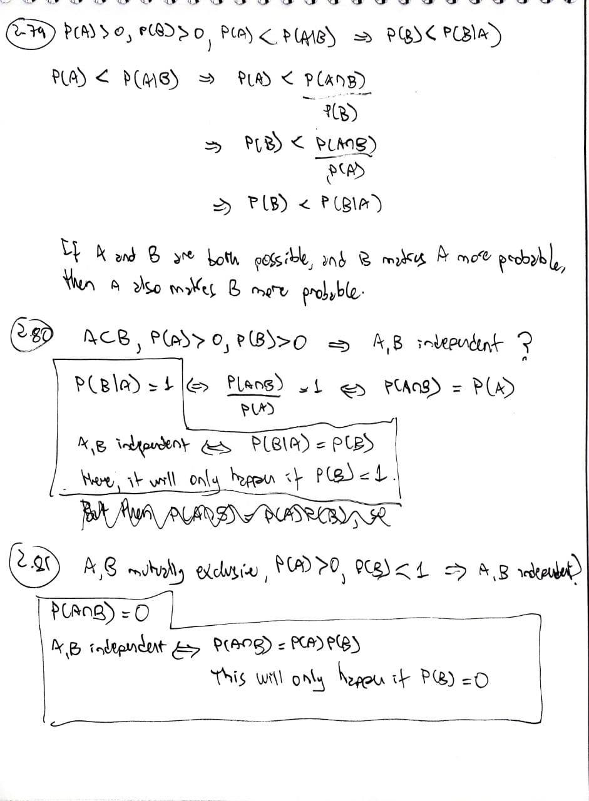{ style="width: 90%" .center}

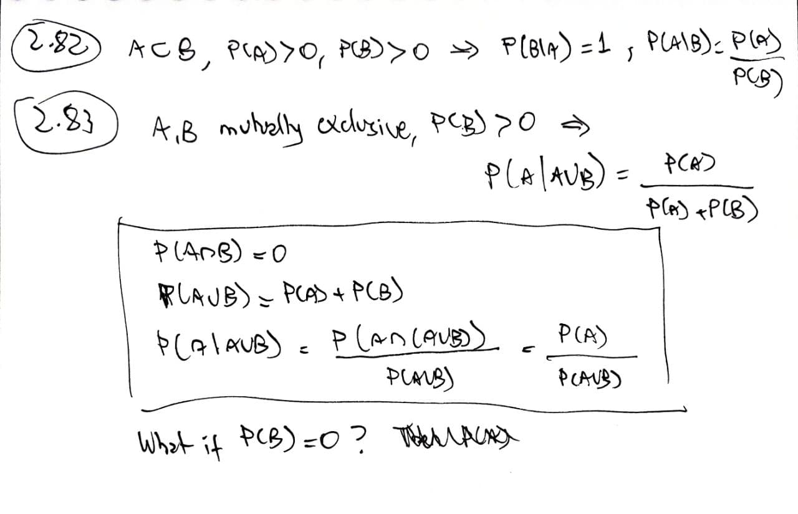{ style="width: 90%" .center}


## 2.8 Laws of probability {-}

### 2.85 through 2.90 {-}

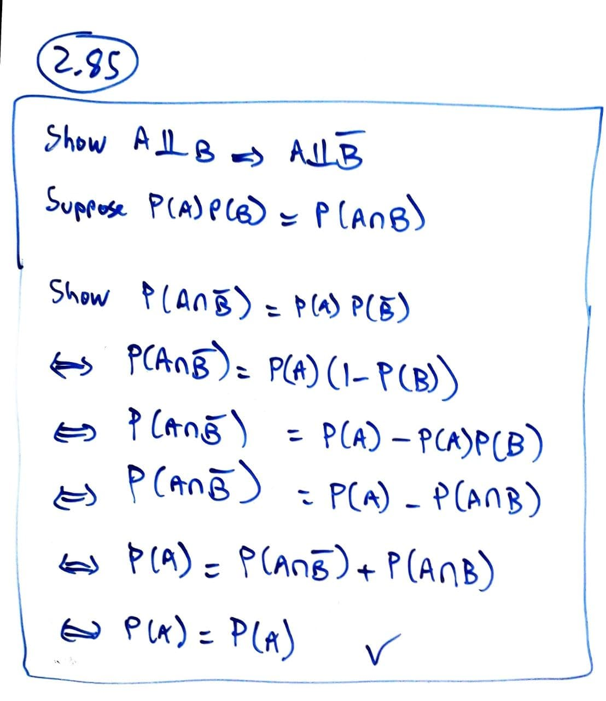{ style="width: 90%" .center}

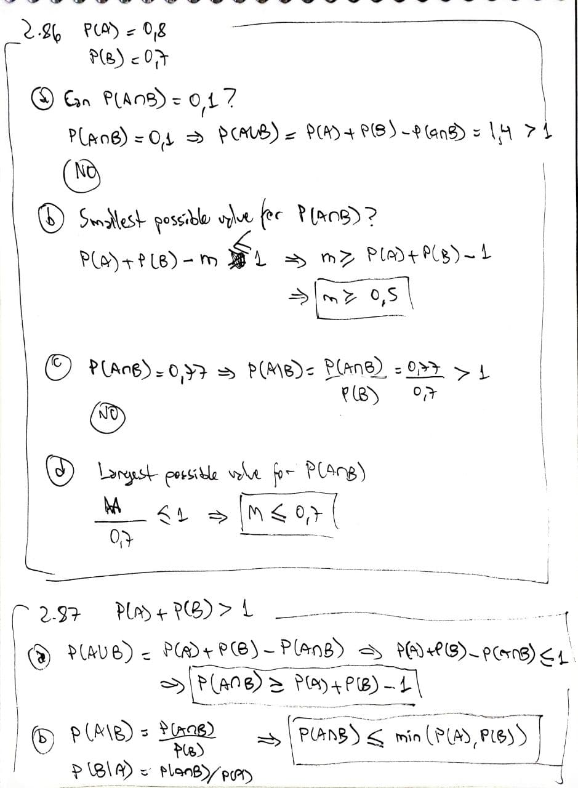{ style="width: 90%" .center}

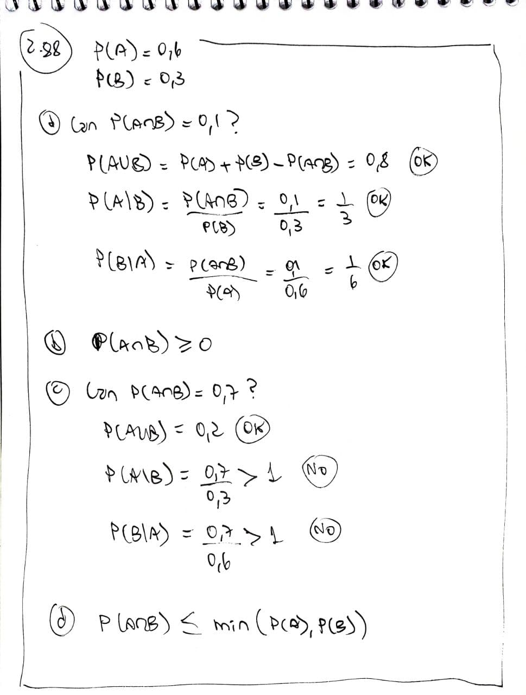{ style="width: 90%" .center}

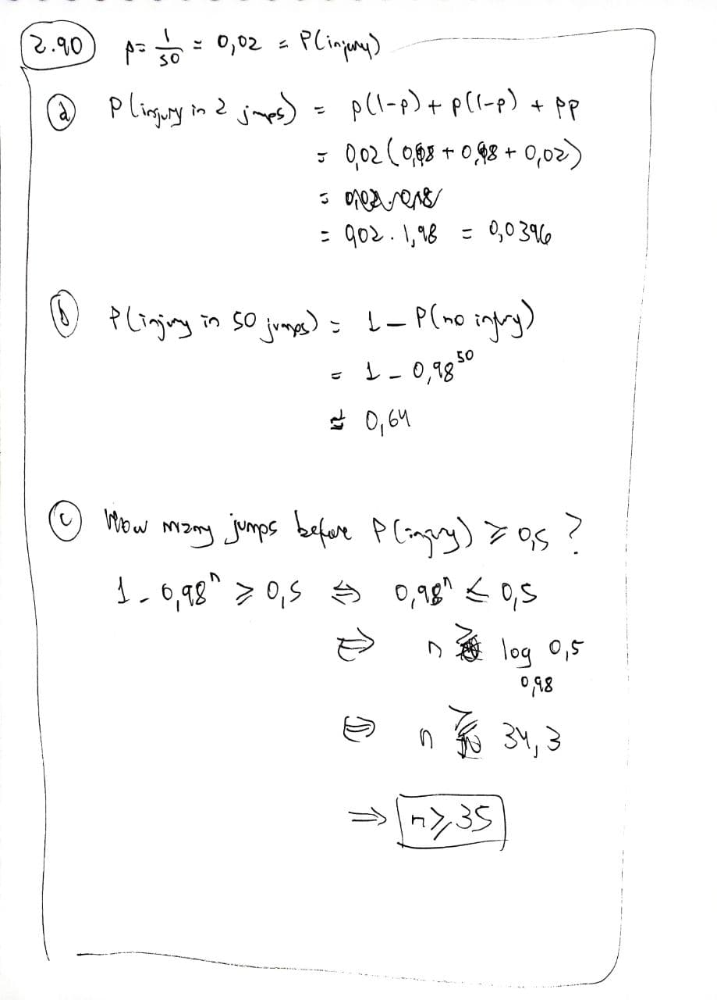{ style="width: 90%" .center}


### 2.104 {-}

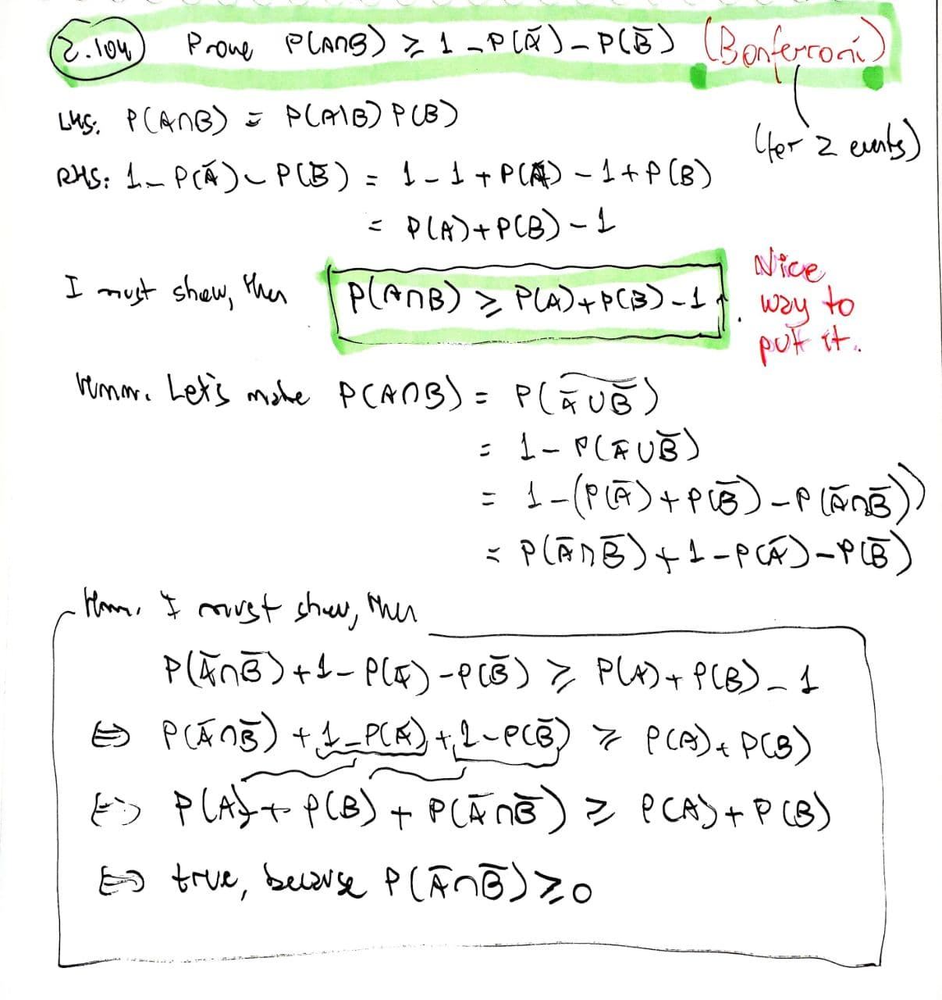{ style="width: 90%" .center}

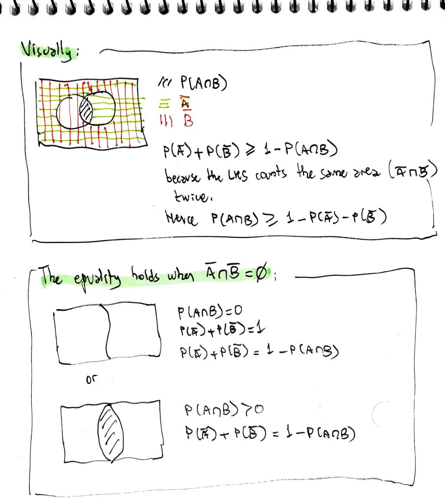{ style="width: 90%" .center}

### Bonferroni's inequalities {-}

See [Wikipedia](https://en.wikipedia.org/wiki/Boole%27s_inequality#Bonferroni_inequalities).

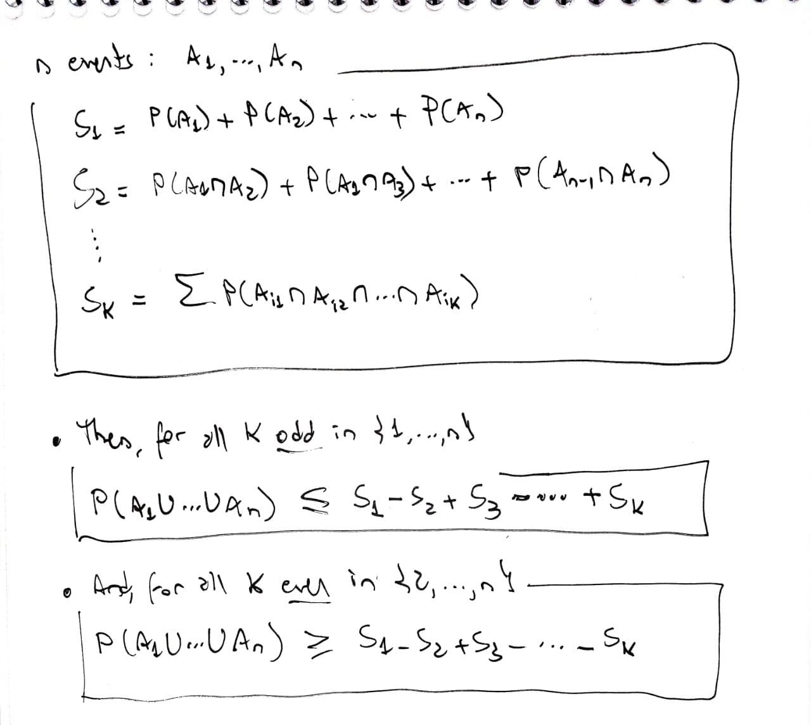{ style="width: 90%" .center}

Exercise 2.104 asks us to show a statement equivalent to
$$
P(A \cap B) \geq P(A) + P(B) - 1
$$
which is implied by
$$
P(A \cap B) \geq P(A) + P(B) - P(A \cup B)
$$
which is Bonferroni's inequality for $2$ events.


### 2.105  {-}

::: {.rmdbox}

If the probability of injury in each parachute jump is $0{,}05$, what is a lower bound for the probability of landing safely on both of two jumps?

:::

* $P(S_1) = P(S_2) = 0{,}95$ is the probability of landing safely on a jump.

* Using $2.104$ 

  $$
  \begin{align*}
  P(S_1 \cap S_2) 
  &\geq 1 - P(\overline{S_1}) - P(\overline{S_2}) \\
  &= 1 - 2 \cdot 0{,}05 \\
  &= 0{,}9
  \end{align*}
  $$

* In fact, $P(S_1 \cap S_2) = `r .95^2`$.

### 2.106 {-}

::: {.rmdbox}

If $A$ and $B$ are equally likely events and we require that the probability of their intersection be at least $.98$, what is $P(A)$?

:::

* As $P(A \cap B) \geq 1 - P(\overline A) - P(\overline B)$, 

  $$
  \begin{align*}
  1 - P(\overline A) - P(\overline B) \geq 0{,}98 
  &\iff 1 - 2P(\overline A) \geq 0{,}98 \\
  &\iff 2P(\overline A) \leq 0{,}02 \\
  &\iff P(\overline A) \leq 0{,}01 \\
  &\iff P(A) \geq 0{,}99
  \end{align*}
  $$


## 2.9 The Event-Composition Method {-}

### 2.119 {-}

::: {.rmdbox}

Suppose that two balanced dice are tossed repeatedly and the sum of the two uppermost faces is determined on each toss. What is the probability that we obtain

a) a sum of $3$ before we obtain a sum of $7$?

a) a sum of $4$ before we obtain a sum of $7$?

:::

* $P(\text{get }3) = 1/18$

* $P(\text{get }4) = 1/12$

* $P(\text{get }7) = 1/6$

* $P(\text{get neither }3\text{ nor }7) = 7/9$

* $P(\text{get neither }4\text{ nor }7) = 3/4$

* Then 

  $$
  \begin{align*}
  P(\text{get }3\text{ before }7)
  &= P(\text{get }3) + P(\text{get }3)P(\text{get neither }3\text{ nor }7) + 
     P(\text{get }3)P(\text{get neither }3\text{ nor }7)^2 + \cdots \\
  &= P(\text{get }3) \cdot \sum_{k = 0}^\infty P(\text{get neither }3\text{ nor }7)^k \\
  &= \frac{1}{18} \cdot \frac{1}{1 - \frac{7}{9}}  \\
  &= \frac14
  \end{align*}
  $$

  $$
  \begin{align*}
  P(\text{get }4\text{ before }7)
  &= P(\text{get }4) + P(\text{get }4)P(\text{get neither }4\text{ nor }7) + 
     P(\text{get }4)P(\text{get neither }4\text{ nor }7)^2 + \cdots \\
  &= P(\text{get }4) \cdot \sum_{k = 0}^\infty P(\text{get neither }4\text{ nor }7)^k \\
  &= \frac{1}{12} \cdot \frac{1}{1 - \frac{3}{4}}  \\
  &= \frac13
  \end{align*}
  $$


## 2.10 The Law of Total Probability and Bayes' Rule {-}

### 2.138 {-}

::: {.rmdbox}

* Following is a description of the game of craps. 

* A player rolls two dice and computes the total of the spots showing.

* If the player’s first toss is a $7$ or an $11$, the player wins the game. If the first toss is a $2$, $3$, or $12$, the player loses the game.

* If the player rolls anything else ($4, 5, 6, 8, 9$ or $10$) on the first toss, that value becomes the player’s point.

* If the player does not win or lose on the first toss, he tosses the dice repeatedly until he obtains either his point or a $7$.

* He wins if he tosses his point before tossing a $7$ and loses if he tosses a $7$ before his point.

* What is the probability that the player wins a game of craps? [Hint: Recall Exercise 2.119.]

:::

$$
\begin{align*}
P(\text{win}) 
&= P(7) + P(11) + {} \\
&\phantom{={}} + P(4) \cdot P(4 \text{ before }7) + {}\\
&\phantom{={}} + P(5) \cdot P(5 \text{ before }7) + {}\\
&\phantom{={}} + P(6) \cdot P(6 \text{ before }7) + {}\\
&\phantom{={}} + P(8) \cdot P(8 \text{ before }7) + {}\\
&\phantom{={}} + P(9) \cdot P(9 \text{ before }7) + {}\\
&\phantom{={}} + P(10) \cdot P(10 \text{ before }7) \\
&= 0{,}493
\end{align*}
$$


## Supplementary exercises {-}

### 2.172 {-}

::: {.rmdbox}

Which are false?

* $P(A \mid B) + P(\bar A \mid \bar B) = 1$

* $P(A \mid B) + P(A \mid \bar B) = 1$

* $P(A \mid B) + P(\bar A \mid B) = 1$

:::

Take this situation:

* We throw a fair die.

* $A = \text{result is } 2 \text{ or } 4$

* $B = \text{result is even}$

* Then $\bar A = \text{result is neither } 2 \text{ nor } 4$

* And $\bar B = \text{result is odd}$

* Then 

  $$
  P(A \mid B) + P(\bar A \mid \bar B) = 2/3 + 1 \neq 1
  $$

* And

  $$
  P(A \mid B) + P(A \mid \bar B) = 2/3 + 0 \neq 1
  $$

* The third equality is true:

  $$
  \begin{align*}
  P(A \mid B) + P(\bar A \mid B)
  &= \frac{P(A \cap B)}{P(B)} + \frac{P(\bar A \cap B)}{P(B)} \\
  &= \frac{P(A \cap B) + P(\bar A \cap B)}{P(B)} \\
  &= \frac{P(B)}{P(B)} \\
  & = 1
  \end{align*}
  $$


