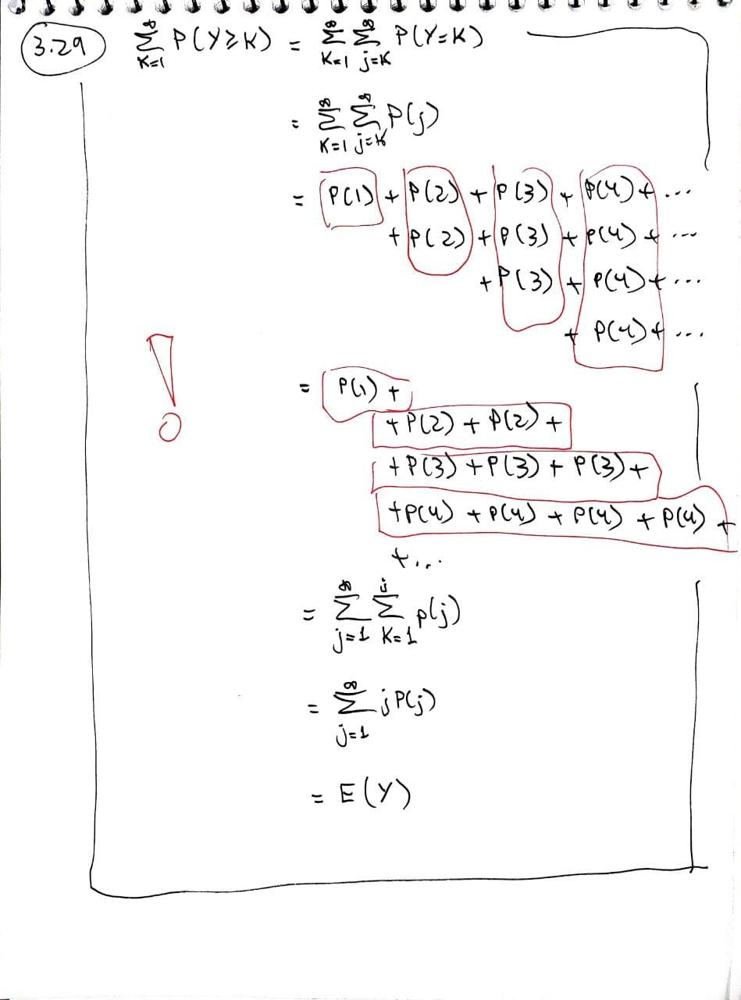

# Chapter 3: Discrete Random Variables and Their Probability Distributions {-}

## 3.2 The Probability Distribution for a Discrete Random Variable {-}

### 3.6 {-}

::: {.rmdbox}

Five balls, numbered $1$, $2$, $3$, $4$, and $5$, are placed in an urn. Two balls are randomly selected from the five, and their numbers noted. Find the probability distribution for the following:

a. The largest of the two sampled numbers

b. The sum of the two sampled numbers

:::

* I consider all possible selections:

  { style="width: 90%" .center}

* Later, I will look into the distribution for the maximum, the minimum etc.


### 3.7 {-}

::: {.rmdbox}

Each of three balls are randomly placed into one of three bowls. Find the probability distribution for $Y ={}$ the number of empty bowls.

:::

* There are $3^3 = 27$ possible placements.

* For $0$ empty bowls: the number of permutations of $123$: $P_3 = 6$.

* For $1$ empty bowl: 

  1. Choose bowl to be empty: $3$.
  
  1. Choose $2$ balls to be together: $3$.
  
  1. Choose one of the nonempty bowls to have $2$ balls: $2$.
  
  For a total of $18$. 
  
* For $2$ empty bowls: $3$

* Distribution:
  
  $$
  \begin{array}{|r|r|}
  \hline
  y 	&  P(Y=y) \\\hline
  0 	&  2/9 	  \\
  1 	&  2/3 	  \\
  2 	&  1/9 	  \\\hline
  \end{array}
  $$


## 3.3 The Expected Value of a Random Variable or a Function of a Random Variable {-}

### 3.29 {-}

::: {.rmdbox}

If $Y$ is a discrete random variable that assigns positive probabilities to only the positive integers, show that
$$
E(Y) = \sum_{k=1}^\infty P(Y \geq k)
$$

:::

{ style="width: 90%" .center}


## 3.4 The Binomial Probability Distribution {-}

### 3.63 {-}

::: {.rmdbox}

{ style="width: 90%" .center}

:::

#### (a) {-}

{ style="width: 90%" .center}

So we have the recursion
$$
p(y) = p(y - 1) \cdot \frac{(n - y + 1)p}{yq} \quad \text{for } y > 0
$$

#### (b) {-}

{ style="width: 90%" .center}


#### (c) {-}

{ style="width: 90%" .center}

{ style="width: 90%" .center}

#### (d) {-}

See [item (c) above](#c).


### 3.64 {-}

::: {.rmdbox}

If there are $n$ trials in a binomial experiment and we observe $n_0$ successes, show that $P(Y = y_0)$ is maximized when $p = \frac{y_0}{n}$.

:::

{ style="width: 90%" .center}


### 3.65 {-}

::: {.rmdbox}

The *maximum likelihood estimator* for $p$ is $\frac{Y}{n}$.

a. Compute $E(Y/n)$.

b. Compute $\text{Var}(Y/n)$. What happens to it as $n$ gets larger?

:::

#### (a) {-}

$$
E\left(\frac Y n\right) = \frac{E(Y)}{n} = \frac{np}{n} = p
$$

This means we have [an unbiased estimator for $p$.]{.hl}


#### (b) {-}

$$
\text{Var}\left(\frac Y n\right) = \frac{\text{Var}(Y)}{n^2} = \frac{npq}{n^2} = 
\frac{pq}{n}
$$

As $n$ gets larger, this tends to zero.

In other words, [if I want to estimate $p$ in a binomial experiment, a larger number of trials will give me a smaller variance.]{.hl}


### More about the binomial distribution {-}

#### Exact test {-}

* Exact test: https://en.wikipedia.org/wiki/Fisher%27s_exact_test


#### Binomial test and $\chi$-squared test {-}

* $\chi$-squared test: https://en.wikipedia.org/wiki/Pearson%27s_chi-squared_test

  > When the test is applied to a contingency table containing two rows and two columns, the test is equivalent to a Z-test of proportions.

  That's why R shows the $\chi^2$ statistic for the binomial test!


## 3.5 The Geometric Probability Distribution {-}

### 3.66 {-}

::: {.rmdbox}

Suppose $Y$ has a geometric distribution.

a. Show $\sum_y p(y) = \sum_{y=1}^\infty q^{y-1}p = 1$.

b. Show $\forall y>1 \;\frac{p(y)}{p(y-1)} = q$. As $q < 1$, $p$ is monotonically decreasing.

:::

a. This is the sum of a geometric progression with first term $p$ and multiplier $q$, which is given by

   $$
   \frac{p}{1-q} = \frac p p = 1
   $$

b. We have

   $$
   \frac{p(y)}{p(y-1)} = \frac{pq^y}{pq^{y-1}} = q
   $$


### 3.71 {-}

::: {.rmdbox}

Let $Y$ denote a geometric random variable with probability of success $p$.

a. Show $\forall a \in \mathbb N, a > 0 \; P(Y>a) = q^a$.

b. Show $\forall a, b \in \mathbb N$

   $$
   P(Y > a + b \mid Y > a) = q^b = P(Y > b)
   $$

   This means the geometric distribution is *memoryless*.

:::

a. We have

   $$
   \begin{align*}
     P(Y>a) &= 1 - P(Y \leq a) \\
            &= 1 - \sum_{i=1}^a pq^i \\
            &= 1 - \frac{p(1 - q^a)}{1 - q} & \text{(sum of a G.P.)}\\
            &= 1 - \frac{(1 - q)(1 - q^a)}{1 - q} \\
            &= q^a
   \end{align*}
   $$
   
b. We have

   $$
   \begin{align*}
     P(Y > a + b \mid Y > a) 
       &= \frac{P(Y > a + b \cap Y > a)}{P(Y > a)} \\
       &= \frac{P(Y > a + b)}{P(Y > a)} \\
       &= \frac{q^{a+b}}{q^a} & \text{(by the previous item)} \\
       &= q^b
   \end{align*}
   $$


### 3.77 {-}

::: {.rmdbox}

Let $Y$ denote a geometric random variable with probability of success $p > 0$. Show that

$$
P(Y = \text{odd integer}) = \frac p {1-q^2}
$$

:::

We have

$$
\begin{align*}
  P(Y = \text{odd integer}) 
    &= \sum_{k=0}^\infty P(Y = 2k+1) \\
    &= \sum_{k=0}^\infty pq^{2k} \\
    &= \frac p {1-q^2} & \text{(sum of a G.P. with ratio } q^2 \text{)}
\end{align*}
$$

Actually, as long as $q<1$, this equals

$$
\frac{1-q}{(1-q)(1+q)} = \frac 1 {1+q}
$$

As a consequence, 

$$
P(Y = \text{even integer}) = \frac q {1+q} 
$$

Which is funny. It is always more probable that $Y$ is odd!?

```{r}
q <- c(
  0, 
  1 / c(4, 3, 2, 3/2, 4/3),
  1
)

p_odd = 1 / (1 + q)
p_even = q / (1 + q)

tibble(q, p_odd, p_even)
```


### 3.85 {-}


### 3.86 {-}


### 3.87 {-}


## 3.6 The Negative Binomial Probability Distribution (Optional) {-}


## 3.7 The Hypergeometric Probability Distribution {-}


## 3.8 The Poisson Probability Distribution {-}


## 3.9 Moments and Moment-Generating Functions {-}


## 3.10 Probability-Generating Functions (Optional) {-}


## 3.11 Tchebysheff’s Theorem {-}


